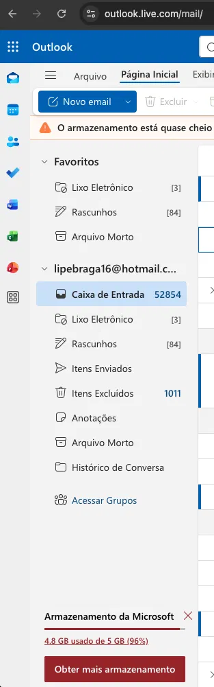
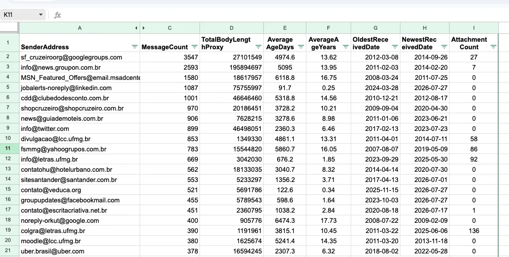

# mail-intelligence-lab

A local-first .NET console tool that reads and understands a real Outlook mailbox via the Microsoft Graph API — before deciding what, if anything, to clean up.

> This is a personal engineering lab, not a product. Phase 0 (Discovery) is complete: authentication, full metadata read, and real attachment sizing against a real 20+ year old mailbox. No message has been modified or deleted by this tool — zero write operations exist in the code today.

---

## Snapshot

|                                                       |                                                  |
| ----------------------------------------------------- | ------------------------------------------------ |
| 🏗️ Architectural layers                               | 1, by design — see [Architecture](#architecture) |
| 📋 ADRs documented                                    | 3                                                |
| ✅ Automated tests                                    | 0 — see [Tests](#tests)                          |
| 📨 Messages read (last full run)                      | 64,582                                           |
| 📎 Attachment weight recoverable only via a heuristic | 733.8 MB (27.6%) — see [Results](#results)       |

---

## Stack

| Category   | Technology                                                     |
| ---------- | -------------------------------------------------------------- |
| Runtime    | .NET 10 (console, top-level statements)                        |
| Mail API   | Microsoft Graph SDK (`Microsoft.Graph`)                        |
| Auth       | Azure.Identity — `DeviceCodeCredential`, persisted token cache |
| Config     | `Microsoft.Extensions.Configuration` (JSON + binder)           |
| CSV export | CsvHelper                                                      |

---

## Index

- [About](#about)
- [Who might find this interesting](#who-might-find-this-interesting)
- [Architecture](#architecture)
- [Architecture Decisions (ADRs)](#architecture-decisions-adrs)
- [How This Was Actually Built](#how-this-was-actually-built)
- [Timeline](TIMELINE.md)
- [Resilience](#resilience)
- [Project structure](#project-structure)
- [Getting started](#getting-started)
- [Tests](#tests)
- [Results](#results)
- [What Was Left Out](#what-was-left-out)
- [Future Evolution](#future-evolution)
- [Roadmap](#roadmap)
- [Evidence and reproducibility](#evidence-and-reproducibility)

---

## About

96% full. That's what my personal Outlook mailbox looked like a few weeks ago.



My first instinct was to start deleting manually — a few minutes in, it was clear that would be practically endless, and automating a blind delete felt worse than doing nothing.

So I set one rule before writing a single line of cleanup logic: **no deletions until I actually understand what's in the mailbox.** This repo starts with the discovery phase — a console tool that authenticates against my own mailbox, reads metadata only, and produces a report. No writes. No deletes. Observation first.

---

## Who might find this interesting

- People sitting on a large, old Outlook mailbox and unsure where to even start
- Developers learning the Microsoft Graph API's real behavior — not just the happy-path docs
- Engineers curious about local-first tools that don't hand personal data to a third party
- Anyone who wants a concrete example of measuring before automating, instead of the reverse

---

## Architecture

```
┌───────────────────────────────────────────┐
│                Program.cs                  │
│         top-level statements only          │
└───────────────────┬─────────────────────────┘
                    │
                    ▼
          DeviceCodeCredential
      (Azure.Identity — cached via
   TokenCachePersistenceOptions + AuthenticationRecord,
        Keychain-backed on macOS)
                    │
                    ▼
           GraphServiceClient
     (User.Read + Mail.Read, delegated)
                    │
      ┌─────────────┼──────────────┐
      ▼              ▼              ▼
 Paginated      Attachment size   CSV export
 message read   fetch (bounded    (CsvHelper,
 (PageIterator, parallelism,      InvariantCulture)
 no delta yet)  SemaphoreSlim(4))
      │              │              │
      └──────────────┴──────────────┘
                    │
                    ▼
         docs/reports/raw/*.csv
           (gitignored — real data)
```

Single process, single external dependency, no internal layering yet — Phase 0 has no business rule complex enough to justify one. Revisited once Phase 1's Action Planner introduces real decision logic worth protecting behind a boundary.

---

## Architecture Decisions (ADRs)

> Architecture Decision Records document decisions that are expensive to reverse and touch more than one part of the system — not every decision that took effort or discussion. Format follows [Michael Nygard's proposal](https://cognitect.com/blog/2011/11/15/documenting-architecture-decisions).

<details>
<summary><strong>ADR-001 — Local-first as a principle, not a feature</strong></summary>

**Status:** Accepted

**Context**
This tool reads a real personal mailbox. Any hosted/backend architecture would mean a third party processing that data, even temporarily.

**Decision**
All processing runs on the local machine, against the user's own Graph credentials. There is no backend service; the only network traffic this tool generates is the Graph SDK's own calls to Microsoft's API.

**Consequences**

- No infrastructure to operate, secure, or pay for
- Full control over what is captured and where it's stored
  − If a hosted layer is ever built (Phase 5), it can only sync already-processed data, never take on the processing itself
  − No shared/multi-device state; each machine authenticates and reads independently

</details>

<details>
<summary><strong>ADR-002 — Authenticating against Microsoft Graph: SDK, device code, and a persisted cache</strong></summary>

**Status:** Accepted

**Context**
The mailbox is a personal Microsoft account (`consumers` tenant), and pagination plus, later, delta query are both needed — non-trivial to hand-roll correctly against a raw `HttpClient`. Device code authentication shipped first with no caching; per-run re-authentication became real friction within days. Full chronology in [Timeline](TIMELINE.md); the two bugs that fix surfaced are in [How This Was Actually Built](#how-this-was-actually-built).

**Decision**
Use `Microsoft.Graph`'s `GraphServiceClient`, backed by an `Azure.Identity` `DeviceCodeCredential`, paired with `TokenCachePersistenceOptions` (cache persisted to the macOS Keychain) and an `AuthenticationRecord` serialized to `~/.mail-intelligence-lab/authrecord.bin`, outside the repository.

**Consequences**

- Pagination and, later, delta query come from a maintained library, not hand-rolled code
- First run authenticates interactively; every run after is silent, until the refresh token's rolling 90-day window lapses
  − `InteractiveBrowserCredential` was rejected: it would require registering a redirect URI and removes zero MFA steps, while device code remains the only flow compatible with a future headless worker (Phase 3 can't open a browser)
  − Larger dependency surface than a raw `HttpClient` call; SDK version upgrades occasionally change method signatures

</details>

<details>
<summary><strong>ADR-003 — Local persistence (SQLite) deferred</strong></summary>

**Status:** Deferred

**Context**
A crashed or interrupted discovery run currently costs the full ~30-minute inbox read again — no message-level state survives past a single process. Phase 1's Action Planner also needs some way to act on specific messages.

**Decision**
Do not add SQLite yet. Phase 1's Action Planner can query Graph directly with a server-side `$filter` (by sender, by date) at execution time, without a local cache of message IDs.

**Consequences**

- No new dependency or schema to design and maintain for a need that may not be load-bearing yet
- Keeps the current single-file structure consistent — no persistence layer to isolate either
  − The ~30-minute re-read cost on interruption remains real and unmitigated
  − Revisited at Phase 3 — see [Future Evolution](#future-evolution)

</details>

---

## How This Was Actually Built

Phase 0 wasn't executed in the tidy order the [Timeline](TIMELINE.md) alone might suggest. Two moments worth telling in full:

**The auth flow that outgrew its first design.** Persisting the login (ADR-002) was pulled forward specifically because repeated interactive re-authentication was actively slowing iteration down — a reprioritization driven by lived friction, not the original plan. Building it surfaced two separate, non-obvious bugs in the same feature: the naive form of `AuthenticateAsync()` silently defaulted to Azure Resource Manager's token scope instead of Graph's, throwing a confusing error that named a Microsoft first-party app ID this project had never touched; and — after fixing that — a second bug where the scope used to _capture_ the cached credential didn't exactly match the scope the Graph SDK requested afterward, causing the device code prompt to fire twice in the same run instead of once.

**A finding that came from caution, not from a known bug.** Real attachment sizing shipped trusting `hasAttachments` alone — a reasonable default, since it's the field Graph provides for exactly this purpose. A diagnostic-only counter, added the same day purely as a sanity check before trusting that number publicly, surfaced thousands of messages the flag was silently missing. Rather than commit to a full mailbox re-read to validate a hypothesis, the fix was proven cheaply first against a 1,000-message sample before being run for real — recovering 733.8 MB that the "official" field alone would have missed. Numbers in [Results](#results).

A smaller but real one: the sender report's `AttachmentCount` column was renamed and reordered before any real analysis was built on it, once a second column (the actual file count) sitting right next to it made the original name's ambiguity obvious.

Full dated sequence, including the smaller commits between these moments, in [TIMELINE.md](TIMELINE.md).

---

## Resilience

<details>
<summary>Implemented + next steps</summary>

### Implemented

| Mechanism                     | Implementation                                                                                                                                                                                                                                                                                                                                                                                                    |
| ----------------------------- | ----------------------------------------------------------------------------------------------------------------------------------------------------------------------------------------------------------------------------------------------------------------------------------------------------------------------------------------------------------------------------------------------------------------- |
| Automatic retry on throttling | The Graph SDK's own `RetryHandler` respects `Retry-After` on `429` responses and caps retries by attempt count and elapsed time — no custom retry policy written on top of it                                                                                                                                                                                                                                     |
| Bounded concurrency           | Attachment fetches are limited to 4 concurrent requests via a shared `SemaphoreSlim(4)`, matching Microsoft's documented per-mailbox concurrency limit for Outlook resources — chosen over `Parallel.ForEachAsync` specifically because the limit belongs to the mailbox, not to any one loop, and a shared semaphore can be reused if a future phase runs a second concurrent operation against the same mailbox |
| Per-message failure isolation | Each attachment fetch is wrapped in its own `try/catch`. A single failing request is logged and recorded as zero bytes for that message; it doesn't abort the other requests in flight                                                                                                                                                                                                                            |

Across the full run to date: **0 failures out of 7,093 attachment requests**, sustaining ~61–63 req/s — comfortably under the documented 10,000-request/10-minute ceiling (about 71% of it in the worst window measured).

### Next steps

No client-side rate limiter exists yet, deliberately: measured throughput has stayed well under the ceiling on every run so far, so instrumentation was chosen over pre-building a limiter with nothing to validate it against. Worth revisiting only if a future phase's measured volume genuinely approaches the ceiling — not before.

</details>

---

## Project structure

```
src/MailIntelligenceLab/
├── Program.cs                  # entry point — auth, paginated read, aggregation,
│                                # attachment fetch, CSV export (single file, see Architecture)
├── Models/
│   ├── EmailMetadata.cs        # per-message record: Id, sender, received date,
│   │                           # hasAttachments, body length, cid: flag
│   └── SenderReportRow.cs      # per-sender aggregate: counts, sizes, age stats
├── appsettings.json            # AzureAd, Discovery, Reports, TokenCache config
└── MailIntelligenceLab.csproj

docs/
├── reports/
│   ├── raw/                    # real CSV output — gitignored
│   └── sanitized/              # fictional example, mirrors current schema
└── evidence/
    ├── raw/                    # real before/after screenshots — gitignored
    └── sanitized/              # masked versions, safe to reference publicly
```

---

## Getting started

### Prerequisites

- [.NET 10 SDK](https://dotnet.microsoft.com/download)
- An Azure AD app registration: public client, device code flow enabled, no redirect URI, `User.Read` + `Mail.Read` delegated permissions, `consumers` tenant (personal Microsoft account)

### Configuration — `appsettings.json`

| Key                                              | Purpose                                                                                     |
| ------------------------------------------------ | ------------------------------------------------------------------------------------------- |
| `AzureAd:ClientId` / `AzureAd:TenantId`          | App registration identity (`TenantId: "consumers"` for personal accounts)                   |
| `Discovery:MaxMessages`                          | Caps the paginated read for test runs; `null` reads the full inbox                          |
| `Reports:RawFolder`                              | Where the CSV report is written (relative path, resolved to absolute at runtime)            |
| `TokenCache:FolderPath` / `TokenCache:CacheName` | Where the persisted auth cache lives (`~/.mail-intelligence-lab/` by default — see ADR-002) |

No secret lives in this file — it's a public client, no client secret involved.

### Running it

```bash
dotnet run
```

**First run:** prints a device code and a URL (`https://www.microsoft.com/link`) — authenticate from any browser, including your phone. **Every run after that:** authenticates silently against the cached `AuthenticationRecord`.

**Example output** (real shape, fictional numbers):

```
Authenticated as: Jane Doe (jane.doe@example.com)

Reading Inbox metadata...
Total read: 12,480 messages
Elapsed: 06:42

Calculating real attachment sizes...
Messages flagged with attachment: 612
cid: candidates (hasAttachments=false): 588
Total to check: 1,200

Requests: 1,200 (failures: 0)
Total attachment size: 340.2 MB
  — recovered only via cid: heuristic: 94.1 MB (27.7%)

Report saved to: docs/reports/raw/2026-01-01_1200_senders-report.csv
```

---

## Tests

None yet. Phase 0 is discovery-only — there's no business decision logic yet worth isolating in a unit test. Starts with Phase 1, once the Action Planner introduces real decision logic (what gets flagged, what gets confirmed) instead of pure read-and-report.

---

## Results

From the most recent full run against a real, 20+ year old personal mailbox:

| Metric                                                                | Value              |
| --------------------------------------------------------------------- | ------------------ |
| Messages read                                                         | 64,582             |
| Time to read (paginated)                                              | 30:34              |
| Messages with `hasAttachments: true`                                  | 3,776              |
| `cid:` candidates (`hasAttachments: false`, inline reference in body) | 3,317              |
| Candidates that returned real attachment data                         | 3,265 (98.4%)      |
| Total attachment requests                                             | 7,093 (0 failures) |
| Measured throughput                                                   | 61.0 req/s         |
| Total real attachment size                                            | 2,655.1 MB         |
| — of which recovered only via the `cid:` heuristic                    | 733.8 MB (27.6%)   |

**Age distribution:** 88% of all messages (56,951 of 64,582) are more than a year old; only 749 arrived in the last 30 days.

**The most useful finding wasn't a single number — it was that different metrics point at different senders.** The senders with the most messages (mailing lists, newsletters) are almost entirely disjoint from the senders with the most attachment weight (personal contacts and institutional accounts sharing real files). Grouped by domain rather than literal address, three clusters — one university department, one hobby community, and this account's own self-sent history across several addresses used over the years — account for close to 40% of all attachment weight combined, despite no single sender individually crossing 10%. This directly shapes how Phase 1's cleanup rules need to work: matching by domain/pattern, not just by literal sender address.

**Example report (sanitized, real Phase 0 output):**



---

## What Was Left Out

| Item                            | Reason                                                                                                                                             |
| ------------------------------- | -------------------------------------------------------------------------------------------------------------------------------------------------- |
| Any deletion or write operation | Phase 1 — requires a dry-run Action Planner with explicit confirmation first. Zero write calls exist in this codebase today.                       |
| Local persistence (SQLite)      | Deferred — see [ADR-003](#adr-003--local-persistence-sqlite-deferred)                                                                              |
| Client-side rate limiting       | Not yet justified by measured request volume — see [Resilience](#resilience)                                                                       |
| AI-based content classification | Phase 2 — requires a PII-masking pipeline (mask → LLM → unmask) before any external model call, not built yet                                      |
| Delta query                     | Phase 3 — plain pagination is sufficient while every run reads the full inbox; delta becomes necessary once incremental sync is the actual problem |
| Any UI beyond the console       | Deliberately gated to Phase 5, and only after Phases 0–2 have run against real data — see roadmap                                                  |

---

## Future Evolution

<details>
<summary>PII-masking pipeline and delta-query sync — context and technologies evaluated</summary>

### PII-masking pipeline (Phase 2)

Content classification requires sending message content to an external LLM. Since this is a personal mailbox, that can't happen unmasked:

```
Message body
    └── Python microservice (Presidio or equivalent)
          ├── Detects and masks PII → reversible tokens
          ├── Masked text sent to Claude for classification
          └── Response unmasked locally before being stored or shown
```

Reversible tokens are kept local-only, never sent externally — consistent with ADR-001's local-first stance. A .NET-native masking library was considered as an alternative to a separate Python service; Presidio's maturity for PII detection specifically was the deciding factor, at the cost of introducing a second runtime into the stack — the first real second container this project would have.

### Delta-query sync (Phase 3)

The daily digest worker can't re-read the full inbox on every run. Microsoft Graph's delta query (`@odata.deltaLink`) is the natural fit — it returns only what changed since the last sync token. This is also where ADR-003 gets revisited: a delta sync needs somewhere to persist the sync token and last-known state, which is the load-bearing need that ADR-003's context describes.

</details>

---

## Roadmap

| Phase | Goal                                                          | Status                |
| ----- | ------------------------------------------------------------- | --------------------- |
| 0     | Discovery — understand the data before touching anything      | **Done**              |
| 1     | Bulk cleanup by metadata, with an Action Planner as guardrail | Not started           |
| 2     | AI content classification, PII-masked pipeline                | Not started           |
| 3     | Daily digest (scheduled worker, delta query)                  | Not started           |
| 4     | Semantic search (RAG)                                         | Not started           |
| 5     | Product decision — UI, hosting, or neither                    | Not decided by design |

---

## Evidence and reproducibility

Real data — the raw CSV reports and any before/after screenshots — lives in `docs/reports/raw/` and `docs/evidence/raw/`, both gitignored. What's committed instead is a sanitized, fictional example CSV (`docs/reports/sanitized/`) that mirrors the current schema exactly, so the shape of the output is verifiable without exposing this mailbox's actual contents.
