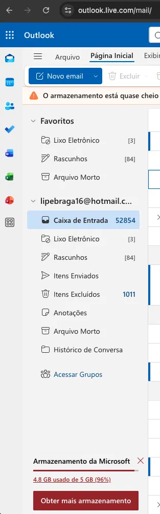
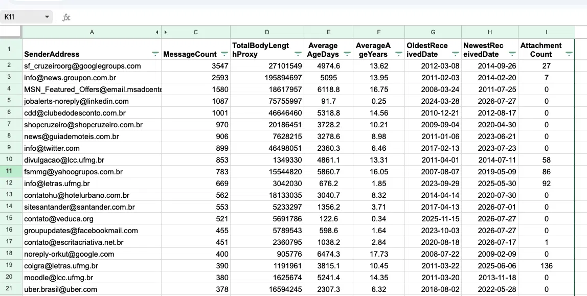

# mail-intelligence-lab

A local-first .NET console tool that reads and understands a real Outlook mailbox via the Microsoft Graph API — before deciding what, if anything, to clean up.

> This is a personal engineering lab, not a product. Phase 0 (Discovery) and Phase 1 (Bulk cleanup) are complete: authentication, full metadata read, real attachment sizing, and a plan-driven deletion workflow that has removed 47,691 messages from a real 20+ year old mailbox. A local API now reads and marks the same plan file the console does, and lists a sender's messages. Every deletion this tool performs requires a plan file, an explicit confirmation typed at the prompt, and leaves an append-only log — see [What deletion actually does](#what-deletion-actually-does).

---

## Snapshot

|                                                       |                                                                             |
| ----------------------------------------------------- | --------------------------------------------------------------------------- |
| 🏗️ Architecture                                       | Hexagonal — 2 ports, 2 driving adapters — see [Architecture](#architecture) |
| 📋 ADRs documented                                    | 6                                                                           |
| ✅ Automated tests                                    | 56 — see [Tests](#tests)                                                    |
| 📨 Messages read (last full run)                      | 64,833                                                                      |
| 📎 Attachment weight recoverable only via a heuristic | 733.8 MB (27.6%) — see [Results](#results)                                  |
| 🗑️ Messages purged (Phase 1, so far)                  | 47,691 across 827 senders, 10 failures                                      |
| 📉 Mailbox storage                                    | 96% → 70%                                                                   |

---

## Stack

| Category   | Technology                                                     |
| ---------- | -------------------------------------------------------------- |
| Runtime    | .NET 10 (console and minimal-API host, top-level statements)   |
| Local API  | ASP.NET Core minimal APIs — localhost only, no hosting         |
| Mail API   | Microsoft Graph SDK (`Microsoft.Graph`)                        |
| Auth       | Azure.Identity — `DeviceCodeCredential`, persisted token cache |
| Config     | `Microsoft.Extensions.Configuration` (JSON + binder)           |
| CSV export | CsvHelper                                                      |

---

## Index

- [About](#about)
- [Who might find this interesting](#who-might-find-this-interesting)
- [Architecture](#architecture)
- [Architecture Decisions (ADRs)](#architecture-decisions-adrs)
- [How This Was Actually Built](#how-this-was-actually-built)
- [What deletion actually does](#what-deletion-actually-does)
- [Timeline](TIMELINE.md)
- [Resilience](#resilience)
- [Project structure](#project-structure)
- [Getting started](#getting-started)
- [Tests](#tests)
- [Results](#results)
- [What Was Left Out](#what-was-left-out)
- [Future Evolution](#future-evolution)
- [Roadmap](#roadmap)
- [Evidence and reproducibility](#evidence-and-reproducibility)

---

## About

96% full. That's what my personal Outlook mailbox looked like a few weeks ago.



My first instinct was to start deleting manually — a few minutes in, it was clear that would be practically endless, and automating a blind delete felt worse than doing nothing.

So I set one rule before writing a single line of cleanup logic: **no deletions until I actually understand what's in the mailbox.** This repo starts with the discovery phase — a console tool that authenticates against my own mailbox, reads metadata only, and produces a report. No writes. No deletes. Observation first.

---

## Who might find this interesting

- People sitting on a large, old Outlook mailbox and unsure where to even start
- Developers learning the Microsoft Graph API's real behavior — not just the happy-path docs
- Engineers curious about local-first tools that don't hand personal data to a third party
- Anyone who wants a concrete example of measuring before automating, instead of the reverse

---

## Architecture

```
┌───────────────────────────────────────────┐
│                Program.cs                  │
│         top-level statements only          │
└───────────────────┬─────────────────────────┘
                    │
                    ▼
          DeviceCodeCredential
      (Azure.Identity — cached via
   TokenCachePersistenceOptions + AuthenticationRecord,
        Keychain-backed on macOS)
                    │
                    ▼
           GraphServiceClient
     (User.Read + Mail.ReadWrite, delegated)
                    │
      ┌─────────────┼──────────────┐
      ▼              ▼              ▼
 Paginated      Attachment size   CSV export
 message read   fetch (bounded    (CsvHelper,
 (PageIterator, parallelism,      InvariantCulture)
 no delta yet)  SemaphoreSlim(4))
      │              │              │
      └──────────────┴──────────────┘
                    │
                    ▼
         docs/reports/raw/*.csv
           (gitignored — real data)
```

Above is the Phase 0 discovery path. Phase 1 added a second path that shares only the credential:

```
docs/reports/raw/*.csv (Phase 0 output — immutable evidence)
│
▼
ActionPlanGenerator   merge by case, exclude unresolvable,
│                      round to integers, Action column blank
▼
docs/plans/raw/*_action-plan.csv ← edited by hand in a spreadsheet
│
▼
ActionPlanValidator   duplicates, unknown actions, unresolvable
│                      senders → whole file rejected, never partial
▼
PlanResolver (preview)   count per sender via $filter, zero writes
│
▼
PlanExecutor (execute)   typed confirmation → delete per message
│                         → append-only log, flushed per row
▼
docs/logs/raw/*_execution-log.csv
```

All decision logic lives in `MailIntelligenceLab.Core`, which references neither `Microsoft.Graph` nor any storage library. It defines two ports — `IEmailProvider` and `IPlanStore` — and everything that makes a decision (`Generate`, `Validate`, `PlanMarker`, `PlanResolver`, `PlanExecutor`, `SenderLocator`, `MessageInspector`) depends only on those interfaces. `MailIntelligenceLab.Adapters` implements both, and is the only project that knows what Microsoft Graph or a CSV file is. Two driving adapters sit on top and never reference each other:

```
 ┌───────────────────────────┐        ┌───────────────────────────┐
 │   ...Console              │        │   ...Api                  │
 │   driving adapter         │        │   driving adapter         │
 │   plan · validate ·       │        │   ASP.NET Core minimal    │
 │   preview · execute ·     │        │   read plan · mark plan · │
 │   verify · inspect ·      │        │   inspect                 │
 │   discovery               │        │   (localhost, no hosting) │
 └─────────────┬─────────────┘        └─────────────┬─────────────┘
               │                                    │
               └────────────────┬───────────────────┘
                                ▼
                 ┌────────────────────────────────┐
                 │   ...Core                      │
                 │   no Graph, no CSV, no I/O     │
                 │   Ports: IEmailProvider        │
                 │          IPlanStore            │
                 │   Planning: the decision logic │
                 └────────────────▲───────────────┘
                                  │ implements
                 ┌────────────────┴───────────────┐
                 │   ...Adapters                  │
                 │   GraphEmailProvider           │
                 │   GraphAuthenticator           │
                 │   FileSystemPlanStore          │
                 └────────────────────────────────┘
```

That seam was revisited three times, each on measured need rather than anticipation: first separating `Planning/` from `Program.cs`, then separating it from Graph entirely ([ADR-005](#adr-005--a-port-for-email-access-hexagonal-over-layered-once-a-second-driving-adapter-made-it-real)) once a second driving adapter made it load-bearing, then separating plan file access ([ADR-006](#adr-006--a-port-for-the-plan-file-one-implementation-and-no-second-in-sight)) once that second adapter had to write the file, not just read it.

**The API deliberately cannot authenticate.** Device code flow needs a human reading a code off a screen; a web host has no screen anyone is watching, so `MailIntelligenceLab.Api` runs with `DisableAutomaticAuthentication`, reads the token cache the console wrote, and returns `401` with an instruction rather than printing a code into a stdout nobody sees. Interactive login has exactly one home, and it is the terminal.

---

## Architecture Decisions (ADRs)

> Architecture Decision Records document decisions that are expensive to reverse and touch more than one part of the system — not every decision that took effort or discussion. Format follows [Michael Nygard's proposal](https://cognitect.com/blog/2011/11/15/documenting-architecture-decisions).

<details>
<summary><strong>ADR-001 — Local-first as a principle, not a feature</strong></summary>

**Status:** Accepted

**Context**
This tool reads a real personal mailbox. Any hosted/backend architecture would mean a third party processing that data, even temporarily.

**Decision**
All processing runs on the local machine, against the user's own Graph credentials. There is no backend service; the only network traffic this tool generates is the Graph SDK's own calls to Microsoft's API.

**Consequences**

- No infrastructure to operate, secure, or pay for
- Full control over what is captured and where it's stored
  − If a hosted layer is ever built (Phase 5), it can only sync already-processed data, never take on the processing itself
  − No shared/multi-device state; each machine authenticates and reads independently

</details>

<details>
<summary><strong>ADR-002 — Authenticating against Microsoft Graph: SDK, device code, and a persisted cache</strong></summary>

**Status:** Accepted

**Context**
The mailbox is a personal Microsoft account (`consumers` tenant), and pagination plus, later, delta query are both needed — non-trivial to hand-roll correctly against a raw `HttpClient`. Device code authentication shipped first with no caching; per-run re-authentication became real friction within days. Full chronology in [Timeline](TIMELINE.md); the two bugs that fix surfaced are in [How This Was Actually Built](#how-this-was-actually-built).

**Decision**
Use `Microsoft.Graph`'s `GraphServiceClient`, backed by an `Azure.Identity` `DeviceCodeCredential`, paired with `TokenCachePersistenceOptions` (cache persisted to the macOS Keychain) and an `AuthenticationRecord` serialized to `~/.mail-intelligence-lab/authrecord.bin`, outside the repository.

**Consequences**

- Pagination and, later, delta query come from a maintained library, not hand-rolled code
- First run authenticates interactively; every run after is silent, until the refresh token's rolling 90-day window lapses
  − `InteractiveBrowserCredential` was rejected: it would require registering a redirect URI and removes zero MFA steps, while device code remains the only flow compatible with a future headless worker (Phase 3 can't open a browser)
  − Larger dependency surface than a raw `HttpClient` call; SDK version upgrades occasionally change method signatures

</details>

<details>
<summary><strong>ADR-003 — Local persistence (SQLite) deferred</strong></summary>

**Status:** Deferred

**Context**
A crashed or interrupted discovery run currently costs the full ~30-minute inbox read again — no message-level state survives past a single process. Phase 1's Action Planner also needs some way to act on specific messages.

**Decision**
Do not add SQLite yet. Phase 1's Action Planner can query Graph directly with a server-side `$filter` (by sender, by date) at execution time, without a local cache of message IDs.

**Consequences**

- No new dependency or schema to design and maintain for a need that may not be load-bearing yet
- Keeps the current single-file structure consistent — no persistence layer to isolate either
  − The ~30-minute re-read cost on interruption remains real and unmitigated
  − Revisited at Phase 3 — see [Future Evolution](#future-evolution)

</details>

<details>
<summary><strong>ADR-004 — The Action Planner: an editable plan file as the only path to a destructive operation</strong></summary>

**Status:** Accepted

**Context**
Phase 1 needs to delete mail from a real mailbox with no undo. Phase 0's discovery found ~4,500 distinct senders — far too many to act on interactively — and that the biggest offenders by attachment weight are not the biggest by message count, so the decision of what to remove is a judgement call that has to be made by a human looking at the data. Three constraints shaped the design: Graph cannot filter by domain suffix on messages (`endswith` is unsupported), so grouping is a client-side concern; a plan generated on Monday may be executed on Wednesday, by which time the mailbox has changed; and any file edited by hand in a spreadsheet can be corrupted in ways the tool must not silently accept.

**Decision**
No destructive operation runs without a generated plan file, edited by hand, validated, and confirmed at the prompt. Four specific choices make that guarantee hold:

1. **Rules, not resolved IDs.** A plan row names a sender, not a list of message IDs. Messages are resolved against Graph at execution time. A frozen ID list would be thousands of rows of base64 — not hand-editable — and would break whenever a message moved.
2. **A freeze bound in the filename.** The plan's UTC generation timestamp is parsed back out of its filename and applied as a `receivedDateTime le` bound on every query, so mail that arrives between generation and execution can never be caught by a plan that never described it.
3. **The action is per row, not a mode.** `delete` and `permanent-delete` are values in the file being approved, printed in the confirmation, and written to the log. No invisible configuration can change what a command does.
4. **Blank means keep.** The generator writes an empty `Action` column. Executing an unedited plan is a no-op; the destructive value only ever exists because someone typed it.

**Consequences**

- The plan file is a reviewable, diffable artifact of intent, separate from the record of what happened — ten rounds, 47,691 messages, 10 failures
- Validation rejects the whole file rather than skipping bad rows: a partially-executed plan would leave the mailbox in a state neither the plan nor the log fully describes
- Re-running a plan is safe: senders already purged resolve to zero and no-op, demonstrated in rounds 2 and 3
- Failures continue rather than abort, each logged individually, with a circuit breaker at 10 consecutive failures — independent failures are worth pushing through, a repeated one means something changed since `preview`
  − Plan counts drift from reality between generation and execution; `preview` reports drift per sender but cannot eliminate it
  − Every round requires a fresh ~27-minute discovery run, because the report is immutable and does not know what was deleted — the friction that will most likely reopen [ADR-003](#adr-003--local-persistence-sqlite-deferred)
  − Grouping by domain or pattern is still unimplemented; Phase 1 matches literal sender addresses only, deferred deliberately after the plan schema proved to accommodate it as one extra column

</details>

<details>
<summary><strong>ADR-005 — A port for email access: hexagonal over layered, once a second driving adapter made it real</strong></summary>

**Status:** Accepted

**Context**
Phase 1's decision logic (`Generate`, `Validate`, `PlanResolver`, `PlanExecutor`, `SenderLocator`, `MessageInspector`) called `GraphServiceClient` directly. That was fine with one driving adapter — the console. A planned local web UI (Phase 5, see [Roadmap](#roadmap)) introduces a second, and duplicating every Graph call and its exception handling into a second language and process wasn't acceptable — the point of a second UI is to reuse proven logic, not re-derive it. A classic controller/service/repository split was considered and rejected: there is no data store to abstract behind a repository, only two things this project has ever crossed a real boundary to reach — Microsoft Graph and the local filesystem. Forcing a repository-shaped abstraction onto a project with neither a database nor a plausible one would have been ceremony without payoff.

**Decision**
Introduce `IEmailProvider`, a port defined in `MailIntelligenceLab.Core/Ports/`, exposing the primitives the domain actually calls: read inbox metadata, count or list a sender's messages, fetch attachment info, delete or permanently delete a message. `MailIntelligenceLab.Adapters` supplies the only adapter, `GraphEmailProvider`, which owns every OData filter string, every Graph-specific exception type, and the one non-obvious constraint discovered while building it: Graph throws `InefficientFilter` when `$orderby` is combined with this project's sender filter unless the ordered property also appears in the filter first, so `GraphEmailProvider` sorts client-side instead. `MailIntelligenceLab.Core` has no reference to `Microsoft.Graph` at all — every class listed above now depends only on the interface.

Delete operations return a result (`DeleteResult` / `DeleteOutcome`: `Deleted`, `AlreadyGone`, `Failed`) rather than throwing, so `Core` never needs to catch a Graph-specific exception type to know what happened.

**Consequences**

- `PlanExecutor`, `PlanResolver`, `SenderLocator`, and `MessageInspector` proved genuinely portable: `MailIntelligenceLab.Api` reuses `MessageInspector` unchanged, exactly as the console does
- Proven under real load before this ADR was written, not speculatively: the read path via `inspect`, the write path via a 468-sender `execute` round (470 real deletions, 0 failures) — see [Results](#results)
- Every Graph-specific detail — filter syntax, the `InefficientFilter` constraint, exception typing — is isolated to one adapter class; a reader auditing what talks to Microsoft's API reads one file, not six
- The predicted move happened as written: when `Api` was scaffolded, `GraphEmailProvider` moved out of `Console` into `MailIntelligenceLab.Adapters`, a project both driving adapters reference and neither owns. Building it surfaced the cost of naming things after the library they wrap — a factory first called `GraphClientFactory` collided with `Microsoft.Graph.GraphClientFactory`, and was renamed `GraphAuthenticator`
  − `discovery` (the bare `dotnet run` full mailbox read) was still not rewired to the port — it calls `GraphServiceClient` directly. Deliberately out of scope: it was never part of what the API needs, and rewiring it isn't free (it also needs a not-yet-called `GetAttachmentInfoAsync` path)
  − Moving the adapter revealed that four classes this ADR described as living in `Core` were still in `Console`: the rewire had happened, the move had not. The ADR was accurate about the dependency direction and wrong about the file layout for several weeks — found by a second adapter trying to use them, not by a reader

</details>

<details>
<summary><strong>ADR-006 — A port for the plan file: one implementation, and no second in sight</strong></summary>

**Status:** Accepted

**Context**
The local API has to read the newest plan and write marks back into it. Plan file access lived in `ActionPlanLoader`, doing direct file I/O from inside `MailIntelligenceLab.Console` — the same shape of problem [ADR-005](#adr-005--a-port-for-email-access-hexagonal-over-layered-once-a-second-driving-adapter-made-it-real) solved for Graph, and the same one that ADR left explicitly unmade. The justification is not the same one, and pretending otherwise would be dishonest: there is no second implementation of a plan store in sight and probably never will be. [ADR-001](#adr-001--local-first-as-a-principle-not-a-feature) rules out a remote store, and SQLite is a separate deferred question ([ADR-003](#adr-003--local-persistence-sqlite-deferred)) about a different problem. Swappability buys nothing here. What does matter is that writing back to a plan file has real rules — every column other than `Action` must survive untouched, the filename carries the freeze bound and cannot change, an unknown sender or an unrecognised action must reject the whole request rather than apply part of it — and rules that live behind a file I/O call cannot be unit tested.

**Decision**
Define `IPlanStore` in `MailIntelligenceLab.Core/Ports/` with three operations: find the newest plan, load one, save one. `FileSystemPlanStore` in `MailIntelligenceLab.Adapters` implements it and contains **no rules at all** — it writes exactly the rows it is handed, to a temporary file in the same directory, then moves that over the target, because a direct write leaves a truncated plan file if the process dies mid-write.

The rules live in `PlanMarker`, a pure function in `Core` that takes the current rows plus a batch of marks and returns either a new row list or the complete list of errors. Sender matching is case-insensitive, because Graph's `eq` on an address is and the plan generator already merges senders by case. Two marks naming the same sender is an error rather than last-wins: there is no defined precedence, and silently picking one would make the result depend on request ordering.

**Consequences**

- The write-back rules are unit tested alongside the rest of the domain — ten tests, no filesystem, no HTTP
- Marking is batched, not per-row: the file on disk is either the state before a marking session or the state after, never a partial application. Consistent with [ADR-004](#adr-004--the-action-planner-an-editable-plan-file-as-the-only-path-to-a-destructive-operation)'s rejection of partial plans
- Proven by round-trip before this ADR was written: marking a sender through the API and then restoring its original value left the 4,198-row file byte-identical to the console-generated original
  − Weaker justification than ADR-005's. This port buys testability, not portability, and a reader looking for a second adapter will not find one
  − `Save` itself is untested, for the same reason `PlanResolver` and `PlanExecutor` are — see [Tests](#tests)
  − Two processes can now write the same plan file with no coordination: the console's `plan` verb and the API's marking endpoint. Harmless for one user with two terminals, unguarded in principle, and the first genuinely new argument for revisiting [ADR-003](#adr-003--local-persistence-sqlite-deferred) since it was written — that ADR deferred SQLite over re-read cost, and never considered concurrent writers

</details>

---

## How This Was Actually Built

Neither phase was executed in the tidy order the [Timeline](TIMELINE.md) alone might suggest. Three moments worth telling in full:

**The auth flow that outgrew its first design.** Persisting the login (ADR-002) was pulled forward specifically because repeated interactive re-authentication was actively slowing iteration down — a reprioritization driven by lived friction, not the original plan. Building it surfaced two separate, non-obvious bugs in the same feature: the naive form of `AuthenticateAsync()` silently defaulted to Azure Resource Manager's token scope instead of Graph's, throwing a confusing error that named a Microsoft first-party app ID this project had never touched; and — after fixing that — a second bug where the scope used to _capture_ the cached credential didn't exactly match the scope the Graph SDK requested afterward, causing the device code prompt to fire twice in the same run instead of once.

**A finding that came from caution, not from a known bug.** Real attachment sizing shipped trusting `hasAttachments` alone — a reasonable default, since it's the field Graph provides for exactly this purpose. A diagnostic-only counter, added the same day purely as a sanity check before trusting that number publicly, surfaced thousands of messages the flag was silently missing. Rather than commit to a full mailbox re-read to validate a hypothesis, the fix was proven cheaply first against a 1,000-message sample before being run for real — recovering 733.8 MB that the "official" field alone would have missed. Numbers in [Results](#results).

**A validator written to catch my typos found seventeen bugs in my own aggregation.** The plan validator exists for hand-editing mistakes — duplicate rows, unrecognised action values. Its first run, against a plan file nobody had touched, reported seventeen duplicate senders. Not typos: Graph's `eq` on an email address is case-insensitive and the Phase 0 report's `GroupBy` was not, so one mailbox sending with inconsistent header casing became two report rows that would resolve to the same messages at execution time. Marking one and leaving the other blank would have deleted both. The fix went into the plan generator rather than the report — the report stays a faithful record of what Graph returned, and every rule about what matches what lives in the layer whose job is matching. This was the second time in Phase 1 that a verification step, not a bug report, caught a discrepancy: the first was a Graph Explorer query run before any Phase 1 code existed, which disagreed with the report by 52 messages and turned out to be the difference between a message's `from` and its `sender`.

A smaller but real one: the sender report's `AttachmentCount` column was renamed and reordered before any real analysis was built on it, once a second column (the actual file count) sitting right next to it made the original name's ambiguity obvious.

Full dated sequence, including the smaller commits between these moments, in [TIMELINE.md](TIMELINE.md).

---

## What deletion actually does

Verified against a real consumer mailbox, not inferred from the Exchange Online docs — the behaviour differs from what those docs describe.

| Plan action        | Where the message goes        | Recoverable by you                                                      | Quota reclaimed  |
| ------------------ | ----------------------------- | ----------------------------------------------------------------------- | ---------------- |
| _(blank)_          | nowhere — no action taken     | —                                                                       | —                |
| `delete`           | Recoverable Items → Deletions | Yes — Outlook: Deleted Items → "Recover items deleted from this folder" | No               |
| `permanent-delete` | Recoverable Items → Purges    | No                                                                      | Yes, immediately |

Neither action puts anything in the **Deleted Items** folder. A Graph `DELETE` behaves like Shift+Delete, not like clicking the bin — which means mail deleted by this tool will appear to have vanished if you go looking for it in the obvious place.

That is why `verify` exists:

```bash
dotnet run -- verify someone@example.com
```

It reports the message count for one sender across the inbox, Deleted Items, and both Recoverable Items folders. The two Recoverable Items folders are in the mailbox's non-IPM subtree and are not browsable in Outlook or OWA, so this is the only way to see where mail actually went.

---

## Resilience

<details>
<summary>Implemented + next steps</summary>

### Implemented

| Mechanism                           | Implementation                                                                                                                                                                                                                                                                                                                                                                                                                                                                                                                                     |
| ----------------------------------- | -------------------------------------------------------------------------------------------------------------------------------------------------------------------------------------------------------------------------------------------------------------------------------------------------------------------------------------------------------------------------------------------------------------------------------------------------------------------------------------------------------------------------------------------------- |
| Automatic retry on throttling       | The Graph SDK's own `RetryHandler` respects `Retry-After` on `429` responses and caps retries by attempt count and elapsed time — no custom retry policy written on top of it                                                                                                                                                                                                                                                                                                                                                                      |
| Bounded concurrency                 | Attachment fetches are limited to 4 concurrent requests via a shared `SemaphoreSlim(4)`, matching Microsoft's documented per-mailbox concurrency limit for Outlook resources — chosen over `Parallel.ForEachAsync` specifically because the limit belongs to the mailbox, not to any one loop, and a shared semaphore can be reused if a future phase runs a second concurrent operation against the same mailbox                                                                                                                                  |
| Per-message failure isolation       | Each attachment fetch is wrapped in its own `try/catch`. A single failing request is logged and recorded as zero bytes for that message; it doesn't abort the other requests in flight                                                                                                                                                                                                                                                                                                                                                             |
| Consecutive-failure circuit breaker | The executor continues past individual failures — deletions are independent, and stopping doesn't undo what already succeeded — but aborts the run after 10 consecutive failures. Systemic problems (an expired token, throttling) present as many identical failures in a row, and pushing thousands more requests into one is worse than stopping. It fired on its first real outing: a scope array updated in one of two places left the cached credential read-only, and the run stopped after 10 `ErrorAccessDenied` responses instead of 131 |
| Per-row log flush                   | The execution log is written and flushed per message, not buffered until the end. A killed process still leaves an accurate record of exactly what was deleted                                                                                                                                                                                                                                                                                                                                                                                     |

Across the full runs to date: **0 failures out of 7,093 attachment requests** at ~61–63 req/s, and **10 failures out of 47,231 delete requests** — all ten in the single aborted run that first proved the circuit breaker (see above) — both comfortably under the documented 10,000-request/10-minute ceiling.

Deletion runs sequentially, deliberately. `preview` measured ~0.4s per sender and execution ~0.17s per message, which puts a 4,000-message round at about 11 minutes — tolerable, and a sequential loop is the only shape in which "10 consecutive failures" is a well-defined condition. Under four concurrent requests, consecutive has no meaning.

### Next steps

No client-side rate limiter exists yet, deliberately: measured throughput has stayed well under the ceiling on every run so far, so instrumentation was chosen over pre-building a limiter with nothing to validate it against. Worth revisiting only if a future phase's measured volume genuinely approaches the ceiling — not before.

</details>

---

## Project structure

```
MailIntelligenceLab.sln

src/MailIntelligenceLab.Core/          # no Microsoft.Graph, no CsvHelper, no I/O
├── Models/
│   ├── EmailMetadata.cs        # per-message record: Id, sender, received date,
│   │                           # hasAttachments, body length, cid: flag
│   ├── SenderReportRow.cs      # per-sender aggregate: counts, sizes, age stats
│   └── ActionPlanRow.cs        # one plan row: report columns + editable Action
├── Ports/
│   ├── IEmailProvider.cs       # every Graph operation the domain calls,
│   │                           # as an interface — MessageSummary, DeleteResult
│   └── IPlanStore.cs           # find newest plan, load one, save one
├── Planning/
│   ├── ActionPlanGenerator.cs  # report → plan (merge by case, exclude, round)
│   ├── ActionPlanValidator.cs  # duplicates, unknown actions, unresolvable
│   ├── PlanMarker.cs           # apply a batch of marks — the write-back rules
│   ├── PlanMark.cs             # one mark: sender address + action value
│   ├── ExecutionLogAggregator.cs # subtract prior rounds' removed messages
│   ├── ExecutionOutcomes.cs    # deleted/purged/already-gone/failed constants
│   ├── PlanResolver.cs         # count per sender via IEmailProvider (preview)
│   ├── PlanExecutor.cs         # delete/purge per message + circuit breaker
│   ├── SenderLocator.cs        # count a sender across mail folders (verify)
│   ├── MessageInspector.cs     # list a sender's messages (inspect)
│   ├── LoadedPlan.cs           # a parsed plan: rows + freeze bound
│   └── *Result.cs / *Row.cs    # result and log records for the above
└── MailIntelligenceLab.Core.csproj

src/MailIntelligenceLab.Adapters/      # the only project that knows Graph or CSV
├── Graph/
│   ├── GraphEmailProvider.cs   # the only class that touches GraphServiceClient —
│   │                           # implements IEmailProvider, owns OData filter
│   │                           # building and Graph-specific exception handling
│   ├── GraphAuthenticator.cs   # device code + persisted cache → GraphServiceClient;
│   │                           # interactive for the console, cache-only for the API
│   └── GraphAuthenticationResult.cs # authenticated / required / failed, returned
│                                    # rather than thrown
├── Planning/
│   └── FileSystemPlanStore.cs  # IPlanStore over the plans folder; saves via a
│                               # temp file then an atomic move. No rules.
└── MailIntelligenceLab.Adapters.csproj

src/MailIntelligenceLab.Console/       # driving adapter — every verb, and the
├── Models/                            # only place that can delete
│   └── AggregationModels.cs    # discovery-only aggregates and age buckets
├── appsettings.json            # AzureAd, Discovery, Reports, Plans,
│                               # ExecutionLogs, TokenCache config
├── Program.cs                  # verb dispatch + the discovery path, which still
│                               # calls GraphServiceClient directly (see ADR-005)
└── MailIntelligenceLab.Console.csproj

src/MailIntelligenceLab.Api/           # driving adapter — reads, marks, inspects;
├── appsettings.json                   # never deletes, never logs you in
│                               # AzureAd, Plans, TokenCache — duplicated from the
│                               # console on purpose, so neither host owns the other
├── Program.cs                  # four minimal-API endpoints
└── MailIntelligenceLab.Api.csproj

tests/MailIntelligenceLab.Tests/ # 56 tests over Core/Planning/ — see Tests
├── SenderReportRowBuilder.cs
├── ActionPlanRowBuilder.cs
├── ActionPlanGeneratorTests.cs
├── ActionPlanValidatorTests.cs
├── ExecutionLogAggregatorTests.cs
├── PlanMarkerTests.cs
└── MailIntelligenceLab.Tests.csproj

docs/
├── reports/
│   ├── raw/                    # real CSV output — gitignored
│   └── sanitized/              # fictional example, mirrors current schema
├── plans/raw/                  # generated + hand-edited plans — gitignored
├── logs/raw/                   # append-only execution logs — gitignored
└── evidence/
    ├── raw/                    # real before/after screenshots — gitignored
    └── sanitized/              # masked versions, safe to reference publicly
```

---

## Getting started

### Prerequisites

- [.NET 10 SDK](https://dotnet.microsoft.com/download)
- An Azure AD app registration: public client, device code flow enabled, no redirect URI, `User.Read` + `Mail.ReadWrite` delegated permissions, `consumers` tenant (personal Microsoft account)

> If you previously ran this with `Mail.Read` only, delete `~/.mail-intelligence-lab/authrecord.bin` before running a command that deletes. The cached credential keeps the scope it was captured with; reads keep working and the first write fails with `ErrorAccessDenied`.

### Configuration — `appsettings.json`

| Key                                     | Purpose                                                                          |
| --------------------------------------- | -------------------------------------------------------------------------------- |
| `AzureAd:ClientId` / `AzureAd:TenantId` | App registration identity (`TenantId: "consumers"` for personal accounts)        |
| `Discovery:MaxMessages`                 | Caps the paginated read for test runs; `null` reads the full inbox               |
| `Reports:RawFolder`                     | Where the CSV report is written (relative path, resolved to absolute at runtime) |
| `Plans:RawFolder`                       | Where generated action plans are written                                         |
| `ExecutionLogs:RawFolder`               | Where append-only execution logs are written                                     |

No secret lives in this file — it's a public client, no client secret involved.

### Running it

```bash
cd src/MailIntelligenceLab.Console
dotnet run                          # discovery — full mailbox read, no writes
dotnet run -- plan                  # newest report → editable action plan
dotnet run -- validate              # check the edited plan, offline
dotnet run -- preview               # resolve against Graph, zero writes
dotnet run -- execute <plan-file>   # confirm, then delete
dotnet run -- verify <address>      # where is this sender's mail now?
dotnet run -- inspect <address> [--all]  # list a sender's messages in the inbox
```

The cleanup loop is `plan` → edit the `Action` column in a spreadsheet → `validate` → `preview` → `execute`. Only `execute` requires an explicit file path: acting on a plan you forgot you had regenerated is the one mistake that can't be undone.

Before running `execute` for the first time, read [What deletion actually does](#what-deletion-actually-does) — deleted mail does not go where you probably expect.

**First run:** prints a device code and a URL (`https://www.microsoft.com/link`) — authenticate from any browser, including your phone. **Every run after that:** authenticates silently against the cached `AuthenticationRecord`.

### Running the local API

```bash
cd src/MailIntelligenceLab.Api
dotnet run
```

| Endpoint                          | Does                                                  |
| --------------------------------- | ----------------------------------------------------- |
| `GET /api/auth`                   | Whether the token cache was usable at startup         |
| `GET /api/plan`                   | The newest plan, every row, unpaginated               |
| `PUT /api/plan/marks`             | Applies a batch of marks to that plan, in place       |
| `GET /api/messages?sender=<addr>` | A sender's messages in the inbox — the `inspect` verb |

It binds to localhost and is not hosted anywhere. **It cannot log you in and it cannot delete anything**: authenticate with the console first, and `execute` remains a terminal command. Authentication is probed once when the API starts and never retried, so if `/api/auth` returns `401`, authenticating in the console is only half the fix — **restart the API afterwards**, or every Graph-backed call keeps failing against the credential state captured at startup. `/api/plan` and `/api/plan/marks` require no credential — they read and write a file already sitting unencrypted on the same disk, and a credential check would gate data the caller could reach with `cat`. That argument holds only while this is one person on localhost.

**Example output** (real shape, fictional numbers):

```
Authenticated as: Jane Doe (jane.doe@example.com)

Reading Inbox metadata...
Total read: 12,480 messages
Elapsed: 06:42

Calculating real attachment sizes...
Messages flagged with attachment: 612
cid: candidates (hasAttachments=false): 588
Total to check: 1,200

Requests: 1,200 (failures: 0)
Total attachment size: 340.2 MB
  — recovered only via cid: heuristic: 94.1 MB (27.7%)

Report saved to: docs/reports/raw/2026-01-01_1200_senders-report.csv
```

---

## Tests

56 tests over `Core/Planning/`, run with `dotnet test` from the repository root.

What they cover is the decision logic and nothing else: `Generate` (case-merge, exclusion of senders no Graph filter can resolve, blank `Action`, message-count-weighted age averaging, ordering), `Validate` (duplicates, unrecognised actions, a marked sender that cannot be resolved, the marked/permanent counts), the `IsActionable` / `IsPermanentDelete` / `IsResolvable` predicates, and `PlanMarker` (applying a batch of marks without disturbing any other column, clearing a mark, case-insensitive sender matching, trimming whitespace around an action value, and rejecting the whole batch on an unknown sender, an unrecognised action, or two marks for the same sender). These are pure functions over in-memory records — no Graph, no filesystem, no HTTP — which is why they were the first thing worth testing and why they were testable at all.

`PlanResolver`, `PlanExecutor`, `SenderLocator`, `MessageInspector` and `FileSystemPlanStore.Save` are untested. Each is a thin loop around a Graph call or a file write, and testing them means either faking `GraphServiceClient` or touching a real mailbox or disk. That's a real gap, deliberately not closed with a mock that would mostly assert that the SDK was called. The API endpoints are untested too, for a narrower reason: each is mostly a `switch` over results the layers beneath already produce, and the mark-validation behaviours worth pinning — unknown sender, unrecognised action, duplicate marks — are pinned one level down, in `PlanMarker`. One behaviour is not, and is worth naming rather than glossing: the stale-filename check, which rejects a marking request whose plan is no longer the newest, lives only in the endpoint. `PlanMarker` never sees a filename. That is the least-covered guard in the write path, and the honest description of it is a gap, not a justified absence.

---

## Results

### Phase 0 — discovery (run of 2026-08-01, against a real 20+ year old personal mailbox)

These are the numbers Phase 0 closed on and are kept as a record. A later re-read on 2026-08-09, after correcting the sender key from `sender` to `from`, measured 64,833 messages and 2,655.8 MB — a week of new mail apart, with the `cid:` hit rate unchanged at 98.4%.

| Metric                                                                | Value              |
| --------------------------------------------------------------------- | ------------------ |
| Messages read                                                         | 64,582             |
| Time to read (paginated)                                              | 30:34              |
| Messages with `hasAttachments: true`                                  | 3,776              |
| `cid:` candidates (`hasAttachments: false`, inline reference in body) | 3,317              |
| Candidates that returned real attachment data                         | 3,265 (98.4%)      |
| Total attachment requests                                             | 7,093 (0 failures) |
| Measured throughput                                                   | 61.0 req/s         |
| Total real attachment size                                            | 2,655.1 MB         |
| — of which recovered only via the `cid:` heuristic                    | 733.8 MB (27.6%)   |

**Age distribution:** 88% of all messages (56,951 of 64,582) are more than a year old; only 749 arrived in the last 30 days.

**The most useful finding wasn't a single number — it was that different metrics point at different senders.** The senders with the most messages (mailing lists, newsletters) are almost entirely disjoint from the senders with the most attachment weight (personal contacts and institutional accounts sharing real files). Grouped by domain rather than literal address, three clusters — one university department, one hobby community, and this account's own self-sent history across several addresses used over the years — account for close to 40% of all attachment weight combined, despite no single sender individually crossing 10%. This directly shapes how Phase 1's cleanup rules need to work: matching by domain/pattern, not just by literal sender address.

**Example report (sanitized, real Phase 0 output):**



### Phase 1 — cleanup

| Metric           | Value        |
| ---------------- | ------------ |
| Rounds executed  | 10 (ongoing) |
| Senders acted on | 827          |
| Messages purged  | 47,691       |
| Failures         | 10           |
| Mailbox storage  | 96% → 70%    |

The first destructive run was deliberately small: 131 messages from a single sender dormant since 2014, whose count had been independently verified in Outlook, using the recoverable `delete` action. Only after `verify` confirmed where those messages had landed — and after recovering and re-purging them to prove `permanent-delete` behaved differently — did larger rounds run.

Sorting by attachment weight found the large offenders quickly, but returns diminished fast — the remaining senders skewed toward high message count and low individual size. `feat: derive plan from report minus prior execution logs` removed the need for a fresh ~27-minute discovery run before every round, and switching the sort key to message count surfaced a different, much larger set of senders: mailing lists and newsletters that barely register in storage terms but account for most of the mailbox's message volume — one round alone purged over 34,000 messages while moving mailbox storage by only two percentage points.

Storage moved the moment each purge completed, without waiting for any retention window, across every round. 10 messages failed across the whole project to date — each logged individually, none aborting a round beyond the deliberate circuit-breaker test.

---

## What Was Left Out

| Item                                            | Reason                                                                                                                                                                                                                                                                                                                                                                            |
| ----------------------------------------------- | --------------------------------------------------------------------------------------------------------------------------------------------------------------------------------------------------------------------------------------------------------------------------------------------------------------------------------------------------------------------------------- |
| Grouping by domain or pattern                   | Phase 1 matches literal sender addresses only. Phase 0 found three domain clusters accounting for ~40% of attachment weight, so this is coming — deferred once the plan schema proved to accommodate it as one extra column, rather than designed in speculatively. See [ADR-004](#adr-004--the-action-planner-an-editable-plan-file-as-the-only-path-to-a-destructive-operation) |
| Any folder other than the inbox                 | Plans resolve senders within the inbox only. Sent Items and Archive are unmeasured and untouched — a real limit on what "space freed" can mean                                                                                                                                                                                                                                    |
| Sorting and marking in a UI                     | Built, in part. A local API now reads the plan, marks it, and inspects a sender — the friction was measured across ten rounds first. The browser frontend that consumes it is not built yet                                                                                                                                                                                       |
| Local persistence (SQLite)                      | Deferred — see [ADR-003](#adr-003--local-persistence-sqlite-deferred)                                                                                                                                                                                                                                                                                                             |
| Client-side rate limiting                       | Not yet justified by measured request volume — see [Resilience](#resilience)                                                                                                                                                                                                                                                                                                      |
| AI-based content classification                 | Phase 2 — requires a PII-masking pipeline (mask → LLM → unmask) before any external model call, not built yet                                                                                                                                                                                                                                                                     |
| Delta query                                     | Phase 3 — plain pagination is sufficient while every run reads the full inbox; delta becomes necessary once incremental sync is the actual problem                                                                                                                                                                                                                                |
| Executing a plan from anywhere but the terminal | Still true today: the API marks the plan file and never deletes. The decision to move the typed confirmation into the UI has been made but not built, and will supersede one point of [ADR-004](#adr-004--the-action-planner-an-editable-plan-file-as-the-only-path-to-a-destructive-operation) when it is                                                                        |
| Per-message selection within a sender           | `inspect` lists a sender's messages but nothing can act on one. This collides deliberately with ADR-004's "rules, not resolved IDs" and needs its own design                                                                                                                                                                                                                      |

---

## Future Evolution

<details>
<summary>PII-masking pipeline and delta-query sync — context and technologies evaluated</summary>

### PII-masking pipeline (Phase 2)

Content classification requires sending message content to an external LLM. Since this is a personal mailbox, that can't happen unmasked:

```
Message body
    └── Python microservice (Presidio or equivalent)
          ├── Detects and masks PII → reversible tokens
          ├── Masked text sent to Claude for classification
          └── Response unmasked locally before being stored or shown
```

Reversible tokens are kept local-only, never sent externally — consistent with ADR-001's local-first stance. A .NET-native masking library was considered as an alternative to a separate Python service; Presidio's maturity for PII detection specifically was the deciding factor, at the cost of introducing a second runtime into the stack — the first real second container this project would have.

### Delta-query sync (Phase 3)

The daily digest worker can't re-read the full inbox on every run. Microsoft Graph's delta query (`@odata.deltaLink`) is the natural fit — it returns only what changed since the last sync token. This is also where ADR-003 gets revisited: a delta sync needs somewhere to persist the sync token and last-known state, which is the load-bearing need that ADR-003's context describes.

</details>

---

## Roadmap

| Phase | Goal                                                          | Status                         |
| ----- | ------------------------------------------------------------- | ------------------------------ |
| 0     | Discovery — understand the data before touching anything      | **Done**                       |
| 1     | Bulk cleanup by metadata, with an Action Planner as guardrail | **Done** — 96% → 70%           |
| —     | Local API over the shared domain                              | **Done** — read, mark, inspect |
| —     | Browser frontend for sorting and marking                      | Next                           |
| 2     | AI content classification, PII-masked pipeline                | Not started                    |
| 3     | Daily digest (scheduled worker, delta query)                  | Not started                    |
| 4     | Semantic search (RAG)                                         | Not started                    |

The UI was never a phase to be reached on schedule — it was gated on the friction proving real. Ten rounds in, sorting and re-reading had both been solved in the terminal and marking had not: every row is an independent keep-or-delete decision, so no pattern-based shortcut survives a plan where adjacent rows disagree. That is what a table with checkboxes solves and a CLI cannot, and that is why this exists now and did not exist at round one.

---

## Evidence and reproducibility

Real data — the raw CSV reports and any before/after screenshots — lives in `docs/reports/raw/` and `docs/evidence/raw/`, both gitignored. What's committed instead is a sanitized, fictional example CSV (`docs/reports/sanitized/`) that mirrors the current schema exactly, so the shape of the output is verifiable without exposing this mailbox's actual contents.
